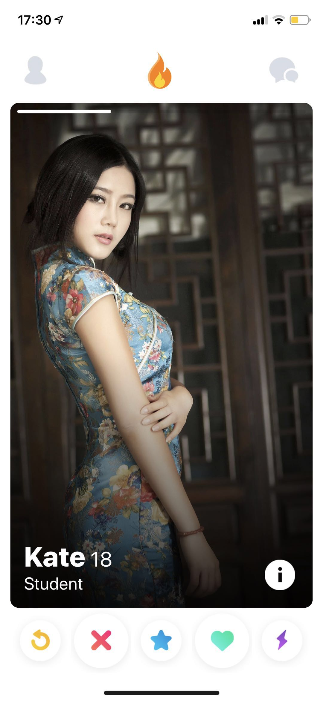

# Matters


{:height="400px" width="300px"}
{:height="700px" width="400px"}

## Getting Started

### Installing

```
pod install
open the .xcwordspace
```

## Built With
* Swift
* [Firebase]() - database


## Third Party Libary
* [SDWebImage]() - download url image
* [JGProgessHUD]() - progress animation
* [GoogleAppMesurement]() 
* [FBSDLoginKit]() - facebook log In

## Contributing

Contributions are always welcome!
Please read the [contribution guidelines](contributing.md) first.

## Authors

* **28cm** - *Initial work* - [Josh Fang](www.joshuafang.com)

## License

This project is licensed under the MIT License - see the [LICENSE.md]() file for details


